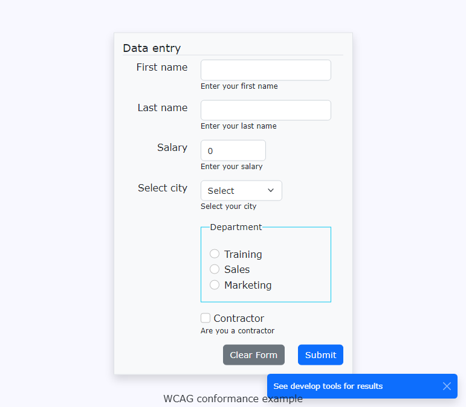
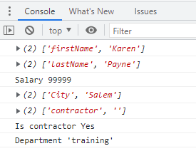

# About

Simple code sample for `aria-checked` in real time for `radio` and `checkboxes` inputs.

OnPost, a toast is shown indicating to open developer tools for post data. In some case the Contractor aria-checked maybe off when clearing the form but that is not going to happen in a real app that post to another page.

Post data

