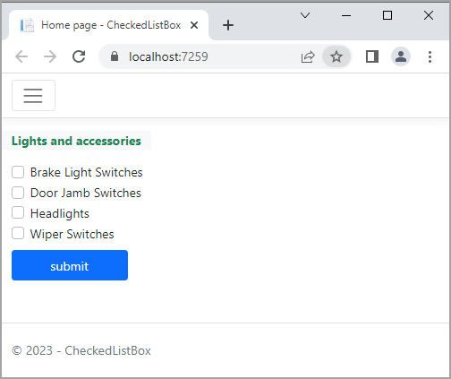

# About

Demonstrates creating a `CheckedListBox` for Razor Pages

TODO: Change to work with a database




## Index1

Uses the following JavaScript code to toggle `aria-checked` attribute on list items when clicked will toggle true/false.

```javascript
@section Scripts
    {
    <script>
        document.addEventListener("DOMContentLoaded", () => {

            $checkboxHelper.initialize(document.getElementsByClassName("form-check-input"));

            document.querySelectorAll("input[type='checkbox']").forEach(cb => {
                cb.setAttribute("aria-checked", cb.checked);

                cb.addEventListener("change", function () {
                    this.setAttribute("aria-checked", this.checked);
                });
            });
        });

    </script>
}
```