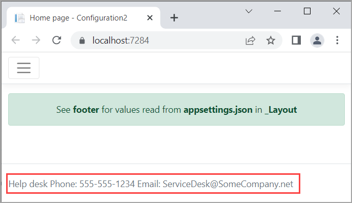

# Access configuration in Razor Pages


In this case we want to display a phone number and email address for the footer of this application.

Create a model

```csharp
public class HelpDesk
{
    public string Phone { get; set; }
    public string Email { get; set; }
}
```

In appsettings.json add the section for HelpDesk

```json
{
  "Logging": {
    "LogLevel": {
      "Default": "Information",
      "Microsoft.AspNetCore": "Warning"
    }
  },
  "AllowedHosts": "*",
  "HelpDesk": {
    "Phone": "555-555-1234",
    "Email": "ServiceDesk@SomeCompany.net"
  }
}
```

In _Layout, add the following at top of page

```csharp
@using Configuration2.Models
@using Microsoft.Extensions.Options
@inject IOptions<HelpDesk> HelpDeskOptions
```

Locate the Footer and replace with


```csharp
<footer class="border-top footer text-muted">
    <div class="container">
        Help desk Phone: @HelpDeskOptions.Value.Phone Email: @HelpDeskOptions.Value.Email
    </div>
</footer>
```

In Program.cs setup depenency injection to read properties for `HelpDesk` model

```csharp
public class Program
{
    public static void Main(string[] args)
    {
        var builder = WebApplication.CreateBuilder(args);
        builder.Services.AddRazorPages();


        builder.Services.Configure<HelpDesk>(
            builder.Configuration.GetSection(nameof(HelpDesk)));


        var app = builder.Build();
```


