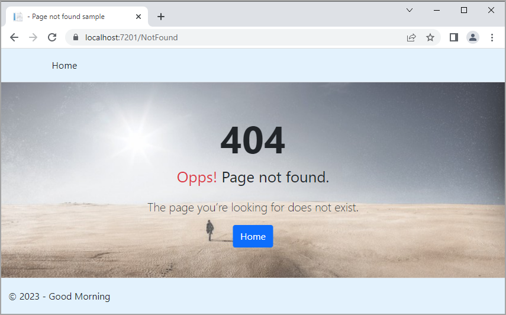

# About

Simple example for a custom `404 page`.

In Program.cs add `app.MapFallback` and the page to redirect, in this case `NotFound`.


```csharp
app.MapRazorPages();

app.MapFallback(context => {
    context.Response.Redirect("/NotFound");
    return Task.CompletedTask;
});

app.Run();
```

## Sample page

