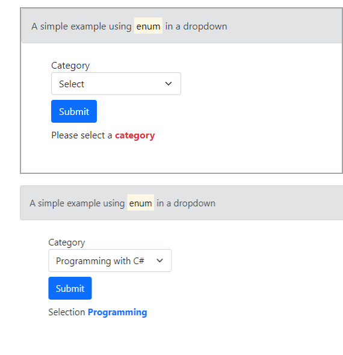

# About

Example for using an enum in a dropdown list. The [Html.GetEnumSelectList](https://learn.microsoft.com/en-us/dotnet/api/microsoft.aspnetcore.mvc.viewfeatures.htmlhelper.getenumselectlist?view=aspnetcore-7.0) method makes it easy to use an enumeration as the data source for a select list. 

```html
<div>
    <label asp-for="Book.Category" class="mt-2"></label>
    <select asp-for="Book.Category" class="form-select" asp-items="Html.GetEnumSelectList<BookCategories>()">
    </select>
</div>
```

## Models

```csharp
public class Book
{
    public int Id { get; set; }
    public string Title { get; set; }
    public BookCategories Category { get; set; }
}
public enum BookCategories
{
    [Description("Options")]
    Select = 0,
    [Display( Name = "Space Travel")]
    SpaceTravel = 1,
    [Display( Name = "Adventure")]
    Adventure = 2,
    [Display(Name = "Popular sports")]
    Sports = 3,
    [Display( Name = "Cars")]
    Automobile = 4,
    [Display( Name = "Programming with C#")]
    Programming = 5
}
```



