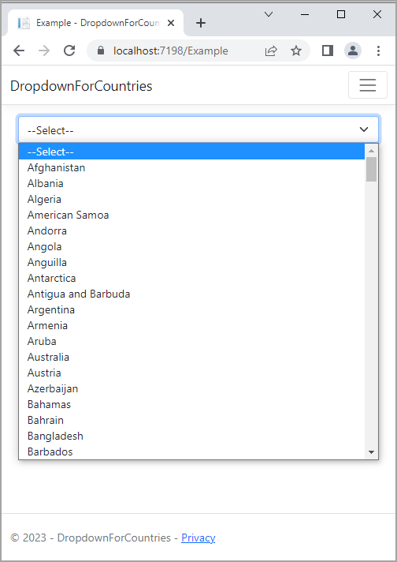

# About

Uses EF Core 7 to populate a dropdown. If the `--Select--` option is selected we stay on the page (no validation is done to indicate a problem, keeping it simple), otherwise the selection is logged via SeriLog.

:pushpin: Before running, run the script under the folder DataScript to create and populate the needed database.

