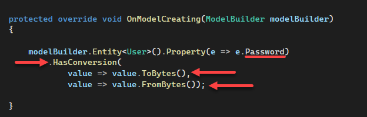

# About

EF Core provides methods to transform one type into another. Most common use is with enumerations ([see using Enum with EF Core](https://dev.to/karenpayneoregon/using-enum-with-ef-core-20go)) while many other transformations are possible. 

In this article a string property `Password` is encrypted when saving to a database table and decrypted when reading from the database table.

Microsoft [simple starter code sample](https://github.com/dotnet/EntityFramework.Docs/blob/main/samples/core/Modeling/ValueConversions/EncryptPropertyValues.cs) for `HasConversion` which in this case takes a string and reverses the string and stores in the table then read back reverses the value back to what was entered.

**Original conversion**

Which allows a developer to work from a simple example to implement their own logic while in this project a NuGet package is used as per below.

```csharp
modelBuilder.Entity<User>().Property(e => e.Password).HasConversion(
    v => new string(v.Reverse().ToArray()),
    v => new string(v.Reverse().ToArray()));
```

**Current conversion**

The conversion here is done with NuGet package [Inferno](https://www.nuget.org/packages/Inferno/) crypto [library](https://securitydriven.net/inferno/), Once configured as shown below the conversion is seamless.




## inferno crypt library

While many developers are aware enough not to roll their own crypto, they either pick the wrong approach, screw up the implementation, or both. Many of these libraries focus on providing as many crypto primitives as possible, which is a [huge disservice](https://spar.isi.jhu.edu/~mgreen/CryptoAPIs.pdf).

I highly recommend taking time to read the [docs](https://securitydriven.net/inferno/).


> **Note**
> Before running this project the database must be created with the script under the folder **Scripts**