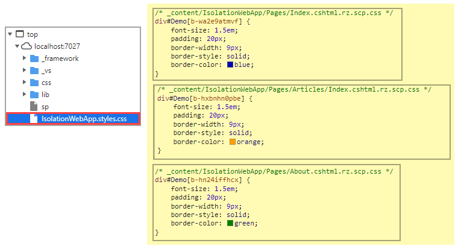

# Razor Pages CSS Isolation

Learn how to prevent dependencies on global styles and helps to avoid styling conflicts among components and libraries of styles in an application where most styles reside under `wwwroot\css\site.css` by using CSS isolation scopes CSS to Razor components, which can simplify CSS and avoid collisions with other components or libraries.


# Pages

There are three pages, <kbd>Index</kbd>, <kbd>About</kbd> and <kbd>Articles\\Index</kbd> were each page will have the same content but by using CSS Isolation each page styles will be independent of the other pages.

# site.css

This is where we define `global` styles for a Razor pages web application. There is one style for `H6` which is overridden in each of the pages mentioned above.

# Razor runtime compilation

:warning: Css isolation may not working with Razor runtime compilation

# Change environments

Several times isolation failed when changing from development to staging environment and worked once back in development. When not working in staging the isolation style sheet file mirrored the page, no CSS.

What appears to be the fix is adding the following to Program.cs

```csharp
builder.WebHost.UseStaticWebAssets();
```

Currently have an issue/ticket with Microsoft, will update if they have a recommendation.

# Steps to setup CSS Isolation on a Razor Page

We will begin with the main page <kbd>Index</kbd> at the root of the project.

1. Right click on `Pages` folder
1. Add a new item, select text file
1. Save the text file as `Index.cshtml.css` which will nest the new file under `Index.cshtml` as shown below.
1. Add styles into `Index.cshtml.css`
1. Open `Index.cshtml` and add `<link rel="stylesheet" href="~/@(nameof(IsolationWebApp)).styles.css" />`. Replace `IsolationWebApp` with the namespace of your project (easy to get from Program.cs)
1. In `Index.cshtml` add one or more elements that use the styles in `Index.cshtml.css`
1. Run the application


Next repeat the above steps for other pages, in the project presented <kbd>About</kbd> and <kbd>Articles\\Index</kbd> have the exact sample styles as <kbd>Index</kbd> but have enough changes to styles so that when running the app the person running the app can see that the styles are isolated to their respective page.

# Under the covers

While running the project, open the browser web tools, travese to, in this case IsolationWebApp.styles.css and note there are sections for each page and note the [b...] identifiers which are injected into the respective page.



</br>


# Caveats

In after change a style, running the project the changes are not reflected open the browser's development tools then back in the browser empty the cache and perform a hard reload.


When adding a link for the style sheet do not use

```css
<link rel="stylesheet" href="~/IsolationWebApp.styles.css" />
```

Use

```css
<link rel="stylesheet" href="~/@(nameof(IsolationWebApp)).styles.css" />
```

This is because in the first example if the namespace changes the style sheet will not be located while in the second example it will be as when renaming the namespace in Visual Studio it will be in `nameof(IsolationWebApp)` when using `nameof`.

# See also

- ASP.NET Core [Blazor](https://learn.microsoft.com/en-us/aspnet/core/blazor/components/css-isolation?view=aspnetcore-6.0) CSS isolation
- CSS isolation for[ MVC Views and Razor Pages](https://asp.net-hacker.rocks/2021/05/10/aspnetcore6-08-css-isolation.html)
- [File nesting](https://learn.microsoft.com/en-us/visualstudio/ide/file-nesting-solution-explorer?view=vs-2022) in Solution Explorer


# Summary

Visual Studio makes it easy to prevent dependencies on global styles and helps to avoid styling conflicts between other pages and components by following the instructions provided.

# Notes

1. CSS Isolation
1. Route for language where language is set in Index and used via `asp-route-lang=@Model.Language`
