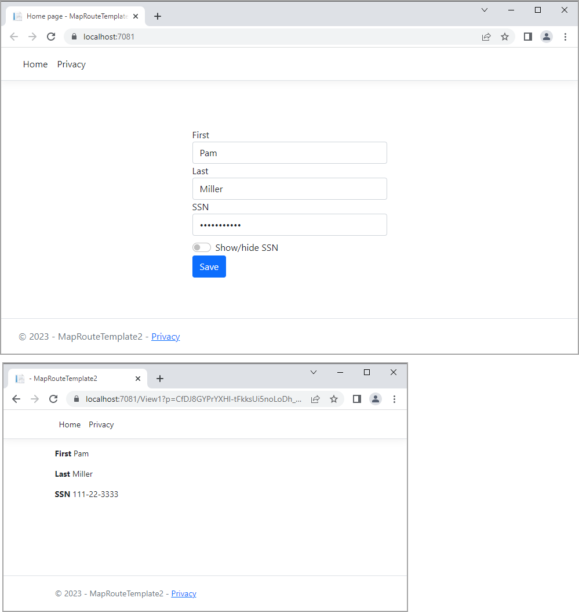

# About

This project demonstrates passing encrypted data from the main page to another page.




## Index page

```csharp
public class IndexModel : PageModel
{
    private readonly ILogger<IndexModel> _logger;
    public IDataProtector Protector;
    [BindProperty]
    public Person Person { get; set; }
    public IndexModel(ILogger<IndexModel> logger, IDataProtectionProvider provider)
    {
        _logger = logger;
        Person = new Person()
        {
            Id = 1,
            FirstName = "Pam", 
            LastName = "Miller",
            SSN = "111-22-3333"
        };

        Protector = provider.CreateProtector("secret");

    }

    public void OnGet()
    {
       
    }

    public IActionResult OnPostAsync()
    {
        return RedirectToPage("View1",  new { p = Protector.Protect(JsonSerializer.Serialize(Person)) });
    }
}

```

## View page

```csharp
public class View1Model : PageModel
{
    public IDataProtector Protector;

    public View1Model(IDataProtectionProvider provider)
    {
        Protector = provider.CreateProtector("secret");
    }

    [BindProperty]
    public Person? Person { get; set; }
        
    public void OnGet(string p)
    {
        Person = JsonSerializer.Deserialize<Person>(Protector.Unprotect(p));
    }
}
```

## See also

`MockupApplication` project