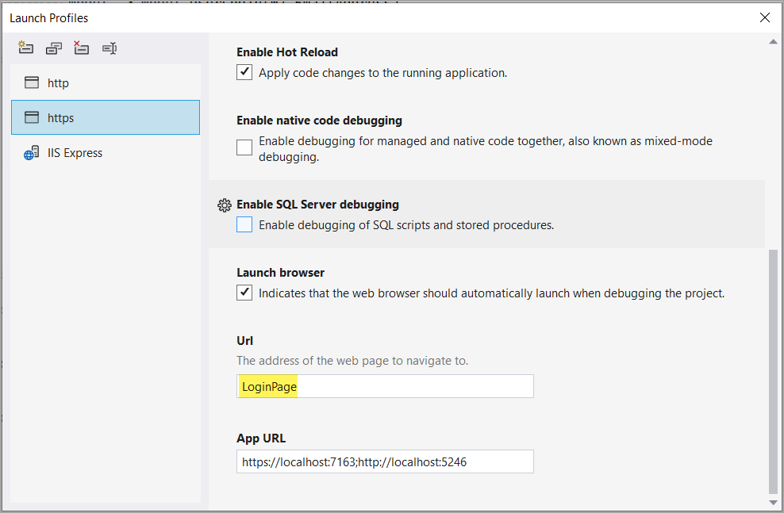
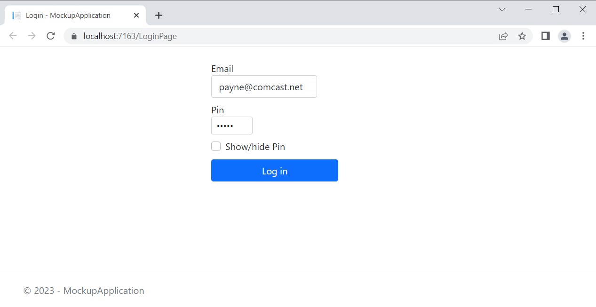

# About

Basic example for working with [IDataProtector](https://learn.microsoft.com/en-us/dotnet/api/microsoft.aspnetcore.dataprotection.idataprotector?view=aspnetcore-7.0) along with a simple login page.

# Main page

Is set as follows



Of course the above does not work for a production app so we use

```csharp
public class HomePageRouteModelConvention : IPageRouteModelConvention
{
    public void Apply(PageRouteModel model)
    {
        if (model.RelativePath == "/Pages/Index.cshtml")
        {
            var currentHomePage = model.Selectors.Single(s => s.AttributeRouteModel!.Template == string.Empty);
            model.Selectors.Remove(currentHomePage);
        }

        if (model.RelativePath == "/Pages/LoginPage.cshtml")
        {
            model.Selectors.Add(new SelectorModel()
            {
                AttributeRouteModel = new AttributeRouteModel
                {
                    Template = string.Empty
                }
            });
        }
    }
}
```

At startup

```csharp
builder.Services.AddRazorPages().AddRazorPagesOptions(options =>
{
    options.Conventions.Add(new HomePageRouteModelConvention());
});
```

# Login page


