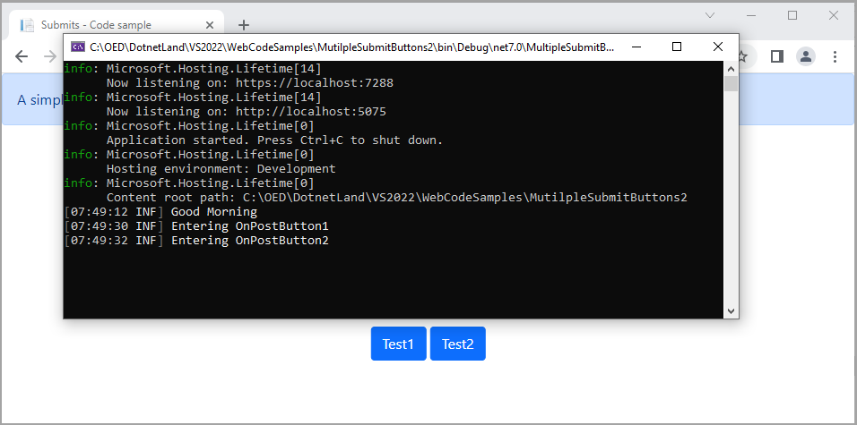

# About

An example using SeriLog demonstrates

- Using a class to setup logging called in Program class

Run the application, click on the buttons then view the results for logging in the console window.

