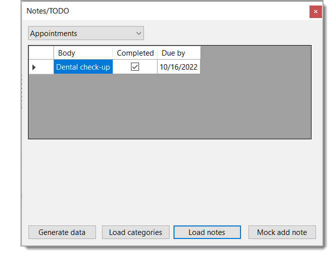

# About

This project is used to validate visually data is as expected from the database design and is not meant to be an application, we will create an ASP.NET Core app for that.

If you compare what it takes to do CRUD in Windows forms vs Razor Pages, Razor Pages requires less work but that is not the point here, the point is to separate us from web to validate data operations work without worrying about security factors.

## Screen shot may be out dated

## Dialogs

Dialogs used are from Nuget package [TaskDialogLibrary](https://www.nuget.org/packages/TaskDialogLibrary) which can targe .net core 6/7.