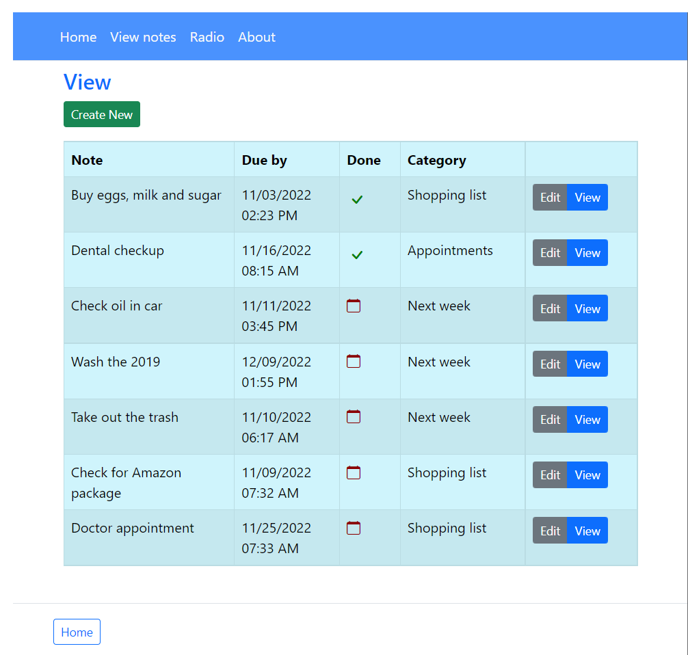
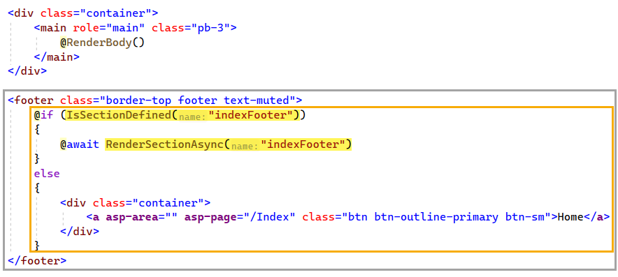
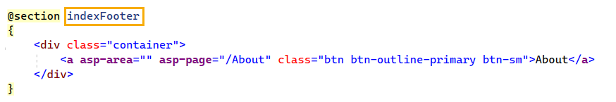

# About

Shows basics of working with two related tables created with EF Core in the project NotesFormApp.

See also, the following [readme](Article/readme.md).



## Editing 

When Visual Studio scaffords a Razor Page using models defined in the project where there are navigations, the default is to display a drop-down with the primary key rather than the text. In this case the model `Note` has a navigation of type `Category`. 

:small_orange_diamond: The majority of code samples do not address the following

Original scafolding code in `EditNote.cshtml.cs`

```csharp
ViewData["CategoryId"] = new SelectList(_context.Category, "CategoryId", "CategoryId");
```

The fix, create a [SelectList](https://learn.microsoft.com/en-us/dotnet/api/system.web.mvc.selectlist?view=aspnet-mvc-5.2) which uses the `Category` model, first parameter, the identifier, second parameter, the text, category name.

Note the use of `nameof` rather than literal strings so if the property name changes in the model it changes here.

```csharp
ViewData["CategoryName"] = new SelectList(
    _context.Category.ToList(), 
    nameof(Note.CategoryId), 
    nameof(Note.Category.CategoryName));
```

**EditNote.cshtml**

```html
<div>
    <label asp-for="Note.CategoryId" class="mt-2">Category</label>
    <select asp-for="Note.Category.CategoryId" class="form-select mb-2" asp-items="ViewBag.CategoryName"></select>
    <span asp-validation-for="Note.CategoryId" class="text-danger"></span>
</div>
```

Note in the above code, the Category navigation is tracked but not Note.CategoryId so in OnPost we need to set Note.CategoryId otherwise sadly a new Category record will be created be Entity Framework Core.

```csharp
Note.CategoryId = Note.Category.CategoryId;

_context.Attach(Note).State = EntityState.Modified;
```

# Format datetime

This is how to format the `DueDate` and any `DateTime` property use [DisplayFormatAttribute](https://learn.microsoft.com/en-us/dotnet/api/system.componentmodel.dataannotations.displayformatattribute?view=net-6.0). Note in the edit page setting `ApplyFormatInEditMode` does not work with the datetime picker.

```csharp
[DisplayFormat(ApplyFormatInEditMode = false, DataFormatString = "{0:MM/dd/yyyy}")]
public DateTime? DueDate { get; set; }
```

# Conditional footer

Many web applications have a footer which has a link to the main page. If there is a menu with a link to the main page, consider using a conditional footer which is defined to display the home page link on all pages other than the main page.

In `_Layoyt.cshtml`



</br>

When in `Index.cshtml` define the section `indexFooter`.




## 06/2023 Editable view

See ViewAddNotes.cshtml which provides a checkbox for completed property which OnPost updates the database.

Note the for statement with a visible input for Completed property

```html
<tbody>

    @for (int index = 0; index < Model.Notes.Count; index++)
    {
        <tr>
            <input type="hidden" asp-for="Notes[index].NoteId" />
            <td>
                <input type="hidden" asp-for="Notes[index].BodyText"/>
                @Model.Notes[index].BodyText
            </td>
            <td>
                <input type="hidden" asp-for="Notes[index].DueDate"/>
                @Model.Notes[index].DueDate
            </td>
            <td>
                <input asp-for="Notes[index].Completed" />
            </td>
        </tr>
    }

</tbody>
```

**OnPost**

- Get the entity from the database including the category
- Update Completed
- Save changes

**FirstOrDefaultAsync** is used rather than **FindAsync** to get the Category property of each note as FindAsync does not support Include.

```csharp
public async Task OnPost()
{
    await SaveChangesForList();
}

private async Task SaveChangesForList()
{
    for (int index = 0; index < Notes.Count; index++)
    {
        var current = Notes[index];
        var note = await _context
            .Note
            .Include(n => n.Category)
            .FirstOrDefaultAsync(x => x.NoteId == Notes[index].NoteId);

        if (note is not null)
        {
            note.Completed = current.Completed;
        }
    }

    await _context.SaveChangesAsync();
}
```


