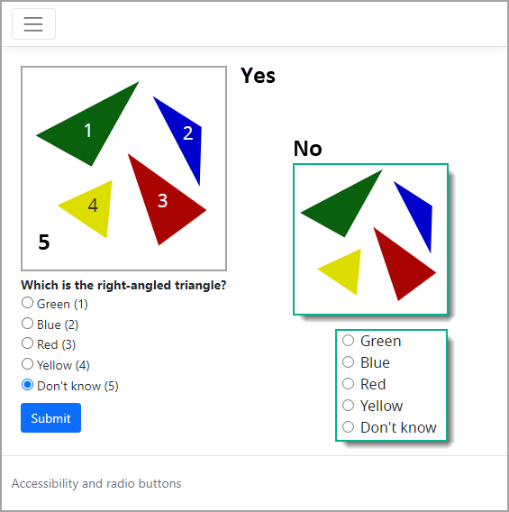

# About

- Working with RadioButtons with a strong type list.
- Providing accessibility
    - Use of numbers for color impaired on image and radio-button elements

- [ARIA Authoring Practices Guide](https://www.w3.org/WAI/ARIA/apg/) (APG)
    - [Radio Group Example](https://www.w3.org/WAI/ARIA/apg/patterns/radio/examples/radio/)
