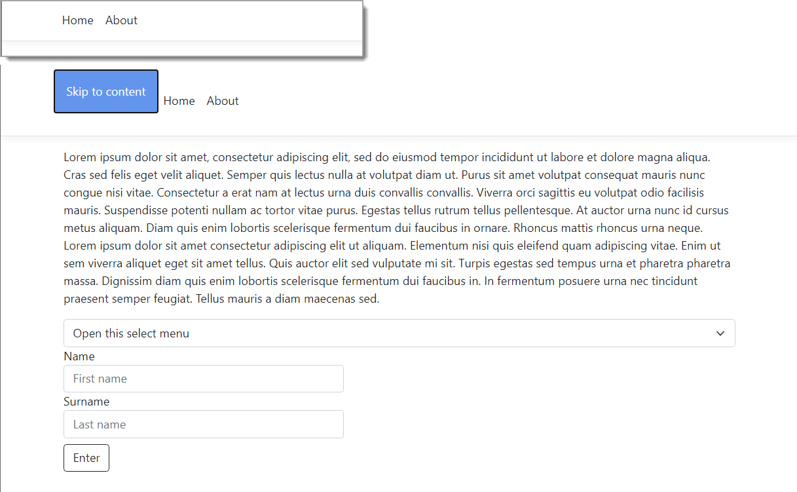

# About

Basic [skip-link](https://webaim.org/techniques/skipnav/) example


## Overview

On most pages, keyboard and screen reader users must navigate a long list of navigation links and other elements before ever arriving at the main content. This can be particularly difficult for users with some forms of motor disabilities. Consider users with no or limited arm movement who navigate a web page by tapping their heads on a switch or that use a stick in their mouth to press keyboard keys. Requiring users to perform any action numerous times before reaching the main content poses an accessibility barrier.

Of course, sighted people who use their mouse do not have any trouble with web pages like this. They can almost immediately scan over the page and identify where the main content is. Skip navigation links are useful to give screen reader and keyboard users the same capability of navigating directly to the main content.


[Creating "Skip Navigation" Links](https://webaim.org/techniques/skipnav/#creating) for non-Razor Pages

Uses

```html
<a href="#main-content">Skip to main content</a>
```

## Razor Pages

With Razor Pages the difference

**asp-fragment** - This attribute specifies an URL fragment section to append the URL.

```html
<a asp-fragment="main-content" Skip to main content</a>
```

Also we can setup a shortcut

```javascript
$(this).on('keydown', function (event) {
    if (event.key === '0' && event.altKey) {
        $("#skipper").focus();
    }
});
```


## See also

- Web Accessibility Guidelines [Skip](http://web-accessibility.carnegiemuseums.org/code/skip-link/) Link
- [Invisible Content Just for Screen Reader Users](https://webaim.org/techniques/css/invisiblecontent/)


## Sample

The skip-link is rather large on purpose. Press <kbd>enter</kbd> selects the form, <kbd>tab</kbd> once to the first input.

css is in site.css

```css
.skip-link {
    position: absolute;
    left: -999px;
    width: 1px;
    height: 1px;
    top: auto;
}
    .skip-link:active, .skip-link:focus {
        background-color: cornflowerblue;
        color: white;
        display: inline-block;
        height: auto;
        width: auto;
        position: static;
        padding: 1em 1em;
        text-decoration: none;
        margin: auto
    }
```


In _Layout.cshtml

```html
<body>

    <header>

        <nav 
            class="navbar navbar-expand-sm navbar-toggleable-sm navbar-light bg-white border-bottom box-shadow mb-3">
            <div class="container">
                <a class="skip-link mb-4"
                   asp-fragment="main-content"
                   aria-label="Skip to content">
                    Skip to content
                </a>
```


