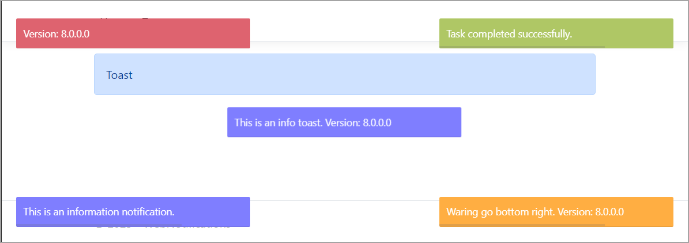

# About

Easy to create toast notifications using [Asp.Net Core abstraction](https://github.com/nabinked/NToastNotify/tree/master)



NuGet packages

- AspNetCoreHero.ToastNotification
- NToastNotify

Configuration

**Program.cs**

```csharp
public class Program
{
    public static void Main(string[] args)
    {
        var builder = WebApplication.CreateBuilder(args);

        // Add services to the container.
        builder.Services.AddRazorPages().AddNToastNotifyNoty(new NotyOptions
        {
            ProgressBar = true,
            Timeout = 5000
        });

        builder.Services.AddNotyf(config =>
        {
            config.DurationInSeconds = 5;
            config.IsDismissable = true;
            config.Position = NotyfPosition.BottomRight;
        });
```

And

```csharp
        app.UseNToastNotify();

        app.UseNotyf();

        app.MapRazorPages();

        app.Run();
    }
}
```

**_Layout.cshtml**

```csharp
    <script src="~/js/site.js" asp-append-version="true"></script>

    @await RenderSectionAsync("Scripts", required: false)
    @await Component.InvokeAsync("NToastNotify")
    @await Component.InvokeAsync("Notyf")
</body>
</html>
```
