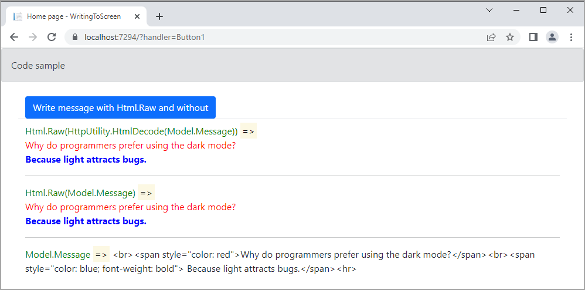

# About

Text output will generally be HTML encoded. Using `Html.Raw` allows you to output text containing html elements to the client, and have them still be rendered as such. Should be used with `caution`, as it exposes you to `cross site scripting vulnerabilities`.

Examples

1. `Html.Raw(Model.Message)` to render HTML
1. `Html.Raw(HttpUtility.HtmlDecode` same results as above but always a string to be converted so that has been HTML-encoded for HTTP transmission into a decoded string
1. `Model.Message` renders any HTML as a string.

